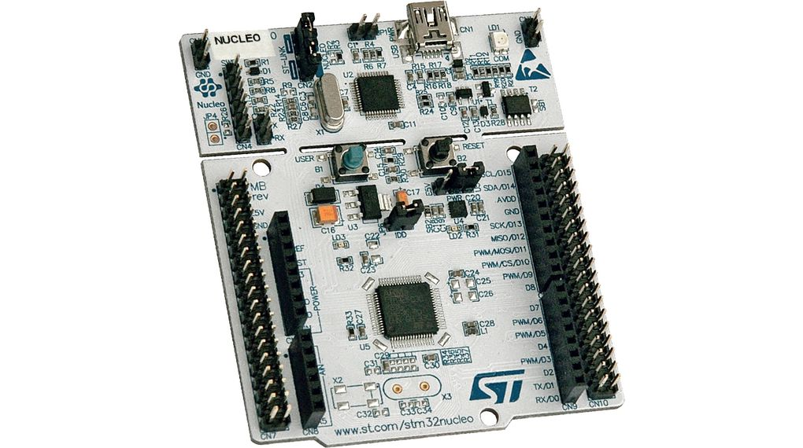
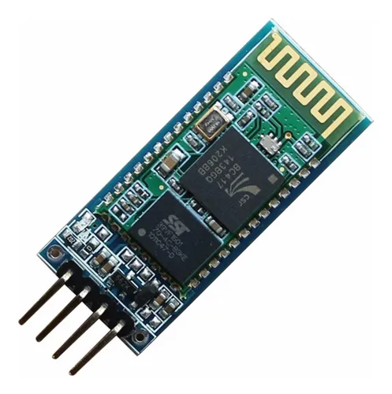
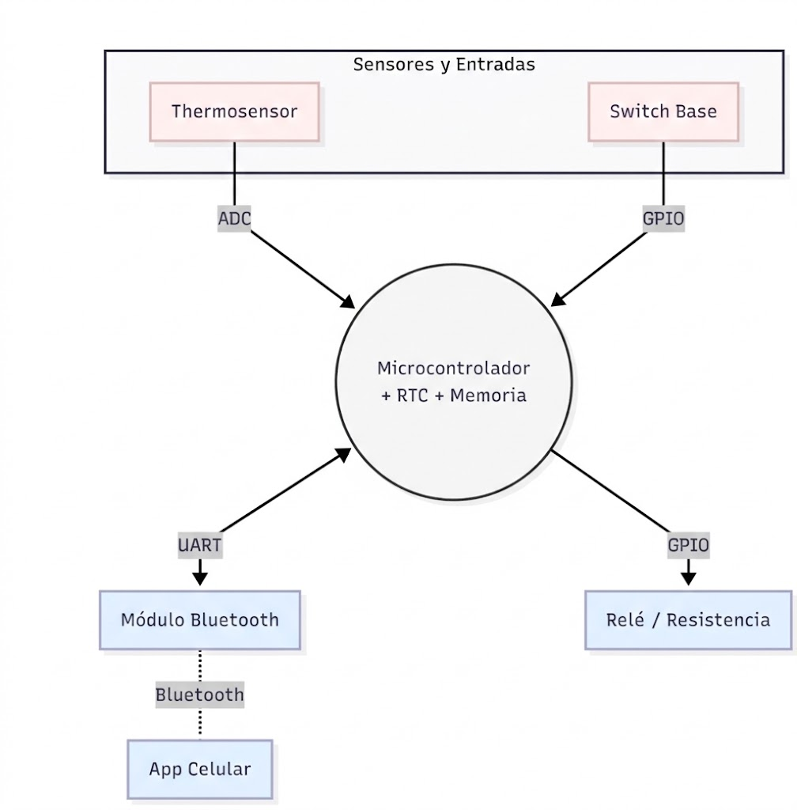
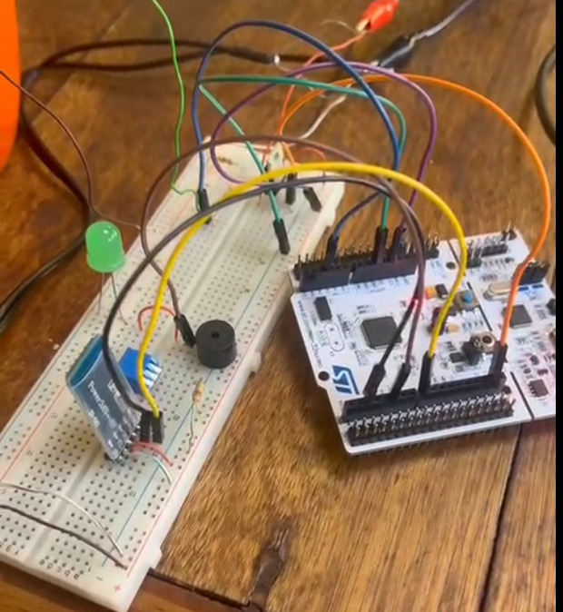
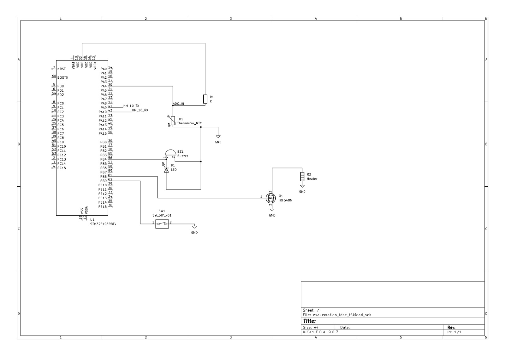
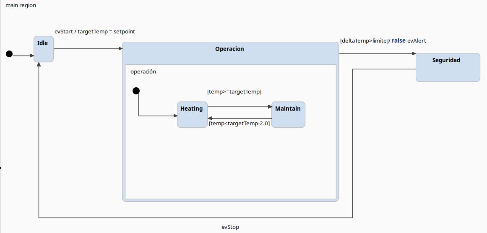
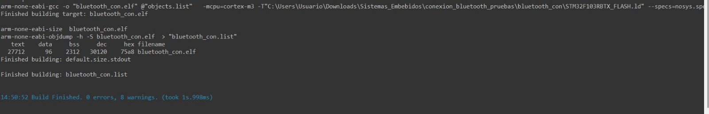
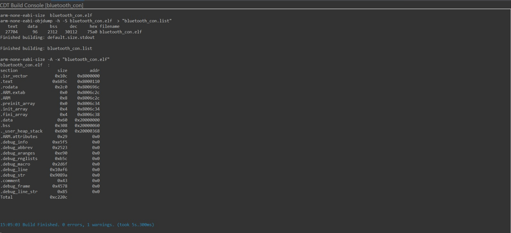

# TDSE_TF_3-06: Jarra Eléctrica Inteligente

**FIUBA - Facultad de Ingeniería UBA** **86.65 Sistemas Embebidos** - Trabajo Práctico Final  
**2do Cuatrimestre 2025**

**Autores:**
- Pauletich Matías (110892)
- Pedranti Guido (111795)
- Rivera Salvador (111091)

---
# Índice General

-[Capítulo 1: Introducción](#capítulo-1-Introducción)

-[Capítulo 2: Especificación de hardware](#2-especificación-de-hardware)
  - [2.1 Tabla de interfaz de Pines](#21-tabla-de-interfaz-de-pines-pinout)
  - [2.2 Unidad de control](#22-Unidad-de-control)
  - [2.3 Sensor de temperatura](#23-Sensor-de-temperatura)
  - [2.4 Actuador e Interfaz de Potencia](#24-Actuador-e-Interfaz-de-Potencia)
  - [2.5 Comunicación Bluetooth](#25-Comunicación-Bluetooth)
  - [2.6 Alimentación](#26-Alimentación)
- [Capítulo 3: Análisis de Productos Similares y Justificación](#3-análisis-de-productos-similares-y-justificación)
  - [3.1 Tabla Comparativa de Soluciones](#31-Tabla-Comparativa-de-Soluciones)
  - [3.2 Ventaja Competitiva y Valor Agregado](#32-Ventaja-Competitiva-y-Valor-Agregado)
  - [3.3 Justificación Técnica](#33-Justificación-Técnica)
- [Capítulo 4: Diseño e Implementación del Sistema](#capítulo-4-Diseño-de-Implementación-del-Sistema)
  - [4.1 Diagrama de Bloques Funcional](#41-Diagrama-de-Bloques-Funcional)
  - [4.2 Listado de Señales y Especificación de Interfaz](#42-listado-de-señales-y-especificación-de-interfaz)
  - [4.3 Consideraciones de Implementación Eléctrica](#43-Consideraciones-de-Implementación-Eléctrica)
  - [4.4 Implementación de la placa y cableado](#44-implementación-de-la-placa-y-cableado)
- [Capítulo 5: Arquitectura de Software](#capítulo-5-Arquitectura-de-Software)
  - [5.1 Planificación de Tareas (Scheduler)](#51-Planificación-de-Tareas-(Scheduler))
  - [5.2 Lógica de Firmware y Configuración](#52-Lógica-de-Firmware-y-Configuración)
  - [5.3 Diseño del Modelo Formal (Statechart)](#53-Diseño-del-Modelo-Formal-(Statechart))
  -  [5.4 Robustez y Seguridad Activa (Fail-Safe)](#54-Robustez-y-Seguridad-Activa-(Fail-Safe))
- [Capítulo 6: Medición de WCET y Factor de Uso (U)](#capítulo-6-Medición-de-WCET-y-Factor-de-Uso-(U))
  - [6.1 Desglose de Tiempos de Ejecución](#61-Desglose-de-Tiempos-de-Ejecución)
  - [6.2 Cálculo del Factor de Uso (U)](#62-Cálculo-del-Factor-de-Uso-(U))
  - [6.3 Análisis de Resultados](#63-Análisis-de-Resultados)

- [Capítulo 7: Medición y Análisis de Consumo](#7-medición-y-análisis-de-consumo)
  - [7.1: Metodología de Medición](#71-metodología-de-medición)
  - [7.2: Resultados de la Etapa Lógica (MCU)](#72-resultados-de-la-etapa-lógica-mcu)
  - [7.3: Resultados de la Etapa de Potencia](#73-resultados-de-la-etapa-de-potencia)
  - [7.4: Análisis y Selección de Bajo Consumo ](#74-análisis-y-selección-de-bajo-consumo)
- [Capítulo 8: Medición de WCET (Worst Case Execution Time)](#8-medición-de-wcet-worst-case-execution-time)
- [Capítulo 9: Console & Build Analyzer](#9-console--build-analyzer)
- [Capítulo 10: Uso de la IA](#10-uso-de-la-ia)
- [Conclusiones](#11-conclusión)

---


# 1. Introducción
El presente trabajo consiste en el desarrollo de una jarra eléctrica inteligente con control de temperatura, conectividad Bluetooth y capacidad de programación horaria. El sistema permite al usuario seleccionar modos predeterminados (Mate a 80°C o Té a 90°C) o definir una temperatura personalizada entre 50°C y 95°C. 

El control de calentamiento se gestiona en tiempo real considerando la temperatura medida, la presencia de agua y la seguridad del sistema.


# 2. Especificación de Hardware

El diseño prioriza la robustez y la separación galvánica entre la etapa de control y la de potencia, utilizando un montaje soldado en placa experimental para garantizar la integridad de las señales.

## 2.1 Tabla de Interfaz de Pines (Pinout)

| Periférico       | Pin Nucleo   | Función                       | Tipo de Señal         |
|------------------|--------------|-------------------------------|-----------------------|
| Sensor NTC       | PA4 (A2)     | Entrada de sensor térmico     | Analógica (ADC)       |
| MOSFET Gate      | PB0 (D3)     | Control de calentador         | Digital (Salida)      |
| Buzzer           | PB4 (D5)     | Alerta sonora de sistema      | Digital (Salida)      |
| Switch           | PB9 (D14)    | Interfaz de usuario física    | Digital (Entrada)     |
| BT RX            | PA10         | Recepción de comandos Bluetooth | UART_RX             |
| BT TX            | PA9          | Transmisión de telemetría     | UART_TX               |
| Display LCD      | PB10, PB1, PB13, PB14, PB15, PA8 | Interfaz visual (6 pines) | Digital (Reservados) |

## 2.2 Unidad de Control

Se utiliza la placa STM32NUCLEO-F103RB (ARM Cortex-M3 @ 16 MHz). Su elección se basa en la disponibilidad de periféricos de alta precisión (ADC de 12 bits) y timers avanzados para la gestión del scheduler cooperativo.

<p align="center">

</p>
<p align="center"><em>Figura 1: Placa STM32NUCLEO-F103RB</em></p>

## 2.3 Sensor de Temperatura

Se utiliza un termistor NTC de 10kΩ(8kΩ medidos a temperatura ambiente). Para la adquisición, se implementó un divisor de tensión con dos resistencias de 4k7 Ω en paralelo, lo que estabiliza la impedancia de entrada al ADC y optimiza la resolución en el rango de trabajo (50°C - 95°C).

<p align="center">

</p>
<p align="center"><em>Figura 2: Sensor Temperatura NTC 10k</em></p>

## 2.4 Actuador e Interfaz de Potencia

Como fuente de calor, se emplea una resistencia sumergible de 2Ω, alimentada con 12V.Con estas condiciones, se obtiene una potencia de 72W, lo suficientemente baja para que no dañe el recipiente (se busca implementar no solo en una jarra si no tambien en tazas, vasos, etc). La conmutación es gestionada por un transistor N-MOSFET IRF540N.

**Seguridad:** Se incluyó una resistencia de Pull-Down de 10kΩ en el Gate para asegurar que el calefactor permanezca apagado durante el arranque o ante fallos del firmware.

<p align="center">

</p>
<p align="center"><em>Figura 3: Resistencia 12V e Interfaz MOSFET IRF540N</em></p>

## 2.5 Comunicación Bluetooth

Se implementa la conectividad inalámbrica mediante un módulo HC-05 configurado a 9600 bps. Este módulo se vincula a la USART1 (PA9/PA10) del microcontrolador para la transmisión de telemetría en tiempo real. Para la comunicación se utilizo la aplicación "Serial Bluetooth Terminal" mediante la cual se pueden enviar comandos desde el celular hacia el nucleo F103RB y viceversa via bluetooth.

<p align="center">

</p>
<p align="center"><em>Figura 4: Módulo Bluetooth HC-05</em></p>

## 2.6 Alimentación

El sistema cuenta con alimentación independiente para mitigar ruidos de conmutación:

- **Lógica:** 3.3V regulados internamente por la placa Nucleo (alimentada vía USB).
- **Potencia:** Fuente de laboratorio de 12V DC dedicada a la resistencia calefactora.


---

# 3. Análisis de Productos Similares y Justificación

El mercado de jarras eléctricas inteligentes presenta soluciones que varían entre el uso doméstico convencional y dispositivos de alta gama con conectividad propietaria. A continuación, se comparan las soluciones líderes frente a la propuesta desarrollada.

## 3.1 Tabla Comparativa de Soluciones

| Producto             | Conectividad       | Control Térmico     | Filosofía de Diseño       | Limitación Identificada                                       |
|----------------------|--------------------|---------------------|----------------------------|---------------------------------------------------------------|
| Ember Mug 2          | Bluetooth (App)    | Preciso (PID)       | Producto de lujo / Personal| Ecosistema cerrado y precio prohibitivo para uso masivo.      |
| Xiaomi Mi Smart Kettle| Bluetooth (Mi Home)| Histéresis fija     | Electrodoméstico Integrado | Interfaz de usuario compleja y dependencia de servidores externos. |
| Smart Jar (Nuestro Proyecto)| Bluetooth (Abierto)| Histéresis configurable| Open Hardware / Modular    | Prototipo en fase de desarrollo (MVP).                        |

## 3.2 Ventaja Competitiva y Valor Agregado

A diferencia de las soluciones comerciales cerradas, nuestro proyecto se distingue por tres pilares fundamentales:

- **Modularidad y Reparabilidad:** Al estar basado en la arquitectura STM32 Nucleo, los componentes (NTC, MOSFET, HC-05) son estándares de mercado. Esto facilita el mantenimiento y la actualización del hardware, algo inexistente en productos como la Xiaomi Kettle, que son descartables ante una falla de placa.
- **Interfaz de Control Abierta:** El uso de una comunicación UART-Bluetooth sin protocolos propietarios permite que cualquier dispositivo (Smartphone, PC o Hub de domótica) pueda recibir la telemetría y enviar consignas, fomentando la integración en hogares inteligentes.
- **Optimización de Costos (BOM):** Se ha diseñado un sistema que cumple con las funciones críticas (seguridad térmica, programación horaria y monitoreo) utilizando una lista de materiales (Bill of Materials) optimizada, eliminando componentes superfluos que encarecen el producto final.

## 3.3 Justificación Técnica

La implementación de una máquina de estados formal y un scheduler cooperativo (detallados en el Punto 5) otorga al proyecto una robustez de grado industrial que supera a las jarras convencionales, las cuales suelen carecer de mecanismos de seguridad redundantes por software como el Watchdog o el monitoreo de gradiente térmico.

---

# 4. Diseño e Implementación del Sistema

La arquitectura del sistema se basa en un modelo de tres capas: Adquisición, Procesamiento y Actuación, vinculadas mediante un bus de señales analógico-digitales gestionadas por la unidad de control STM32.

## 4.1 Diagrama de Bloques Funcional

El flujo de información comienza en el sensor NTC, cuya señal analógica es digitalizada por el ADC. El firmware procesa esta información y, mediante un algoritmo de control por histéresis, comanda la etapa de potencia y la telemetría.

<p align="center">

</p>
<p align="center"><em>Figura 5: Arquitectura sistémica y flujo de señales del proyecto</em></p>

## 4.2 Listado de Señales y Especificación de Interfaz

Se definen las señales críticas del sistema, especificando su naturaleza eléctrica y su función dentro del lazo de control:

| Señal         | Periférico    | Tipo             | Nivel Lógico / Rango | Descripción                                                  |
|---------------|---------------|------------------|-----------------------|--------------------------------------------------------------|
| TEMP_ADC      | ADC1_IN4      | Entrada Analógica| 0-4095 (12 bits)           | Tensión variable del divisor NTC para cálculo de temperatura. |
| HEATER_CTRL   | GPIO_PB0      | Salida Digital   | 0V (OFF) / 3.3V (ON)  | Control de Gate del MOSFET IRF540N.                          |
| BUZZER_OUT    | GPIO_PB4      | Salida Digital   | High-Low        | Generación de alertas sonoras de usuario.                    |
| USER_SW       | GPIO_PB9      | Entrada Digital  | Pull-up Interno       | Interfaz física para habilitar o deshabilitar el uso del buzzer.                   |
| BT_UART_TX    | USART1_TX     | Salida Digital   | LVTTL (3.3V)          | Transmisión de tramas de telemetría al HM-10.                |
| BT_UART_RX    | USART1_RX     | Entrada Digital  | LVTTL (3.3V)          | Recepción de consignas y comandos remotos.                   |
| VCC_12V       | Power Rail    | Alimentación     | 12V DC / 1A           | Línea de potencia dedicada a la resistencia calefactora.     |

## 4.3 Consideraciones de Implementación Eléctrica

- **Acondicionamiento de Señal:** La señal TEMP_ADC incluye un filtrado por hardware (capacitor de desacople en el divisor) y un filtrado por software (promedio móvil) para garantizar lecturas estables frente al ruido de conmutación de la carga de 12V.
- **Integridad de Señal en Potencia:** Debido a las corrientes de 6.7A que circulan por la resistencia, se utilizó un cableado de mayor sección para la línea VCC_12V, minimizando caídas de tensión que podrían afectar la referencia de masa del ADC.
- **Seguridad por Hardware:** La señal HEATER_CTRL está vinculada a una resistencia de pull-down física de 10kΩ, garantizando que el sistema sea Fail-Safe ante una desconexión accidental del cableado de control.


## 4.4 Implementación de la placa y cableado

Para el desarrollo del trabajo practico se utilizo protoboard para el prototipado y armado de la placa. Se usaron cables macho-macho para la conección entre la placa modulo y la protoboard y cables para las conecciones internas dentro de la protoboard

<p align=center>

</p>
<p align="center"><em>Figura 6: implementacion de la placa</em></p>

Asimismo, se presenta el esquema eléctrico del mismo. Esta herramienta nos fue de gran ayuda para evitar problemas de conexionado y seccionar el circuito.
<p align=center>

</p>
<p align="center"><em>Figura 7: Esquema eléctrico</em></p>

# 5. Arquitectura de Software

Se implementó una arquitectura de Superloop Cooperativo para garantizar el determinismo en las tareas críticas y un control preciso de la temperatura. Esta estructura permite una ejecución secuencial de tareas con tiempos de respuesta predecibles, evitando condiciones de carrera.

## 5.1 Planificación de Tareas (Scheduler)

El sistema organiza el flujo de trabajo en tareas con períodos fijos, gestionadas por un "tick" de sistema generado por un Timer de hardware:

| Tarea            | Período | Descripción Técnica                                                                        |
|------------------|---------|---------------------------------------------------------------------------------------------|
| Task_ReadNTC     | 100 ms  | Adquisición de datos vía ADC con filtrado de promedio móvil (10 muestras) para eliminar ruido eléctrico. |
| Task_Control     | 100 ms  | Lógica de histéresis y verificación de seguridad (gradiente térmico y límites del sensor).  |
| Task_Bluetooth   | 200 ms  | Procesamiento de comandos UART a 9600 bps y envío de telemetría de estado.                  |
| Task_Scheduler   | 1 s     | Verificación de alarmas horarias y actualización de reloj interno.                          |

## 5.2 Lógica de Firmware y Configuración

El microcontrolador opera a 72 MHz. Los periféricos se configuraron mediante el HAL de STM32 para asegurar la portabilidad y robustez:

- **ADC1:** Configurado en modo Single Conversion para el sensor NTC.
- **UART2:** Interfaz para el módulo HC-05 con manejo de interrupciones para no bloquear el loop principal.
- **IWDG:** Independent Watchdog con un timeout de 500ms para recuperación automática ante fallos críticos.

```c
// Estructura del Loop Principal
while(1) {
    if (Timer_Tick) {
        Task_ReadNTC();    // Adquisición y filtrado
        Task_Control();    // Seguridad
        Task_Bluetooth();  // Comunicación remota
        Task_Scheduler();  // Gestión de alarmas
        
        HAL_IWDG_Refresh(&hiwdg); // Refresco del Watchdog de seguridad
        Timer_Tick = 0;
    }
    __WFI(); // Entrada en modo "Sleep" para optimización de consumo energético
}
```

## 5.3 Diseño del Modelo Formal (Statechart)

La lógica se rige por un modelo de estados desarrollado en itemis Create, asegurando que el sistema solo active la potencia si se cumplen todas las condiciones de seguridad.

<p align="center">

</p>
<p align="center"><em>Figura 8: Statechart del sistema desarrollado en itemis Create</em></p>

**Lógica de operación destacada:**

- **Prioridad de Interrupción:** El Systick posee la prioridad máxima para garantizar que el `Timer_Tick` ocurra siempre cada 100 ms, asegurando el determinismo del sistema.

## 5.4 Robustez y Seguridad Activa 

Dado que el control de potencia depende únicamente del MOSFET, se integraron las siguientes protecciones en el firmware:

- **Detección de Sensor Fallado:** La `Task_ReadNTC` monitorea los niveles de tensión del ADC. Si la lectura es $< 0.3\,\text{V}$ (sensor abierto) o $> 3.1\,\text{V}$ (sensor en corto), el sistema apaga el calentador inmediatamente por seguridad.
- **Protección contra Marcha en Seco:** Se monitorea el gradiente térmico ($\Delta Temp$). Si se detecta un incremento brusco $> 15\,°\text{C}$ en un ciclo, se asume falta de agua y se bloquea el sistema disparando un evento de alerta.
- **Seguridad por IWDG:** Si el Superloop se bloquea por más de 500 ms (ej. fallo en el bus UART), el hardware reinicia la CPU, llevando las salidas de potencia a estado seguro (OFF).

**Nota para la integración:** Para garantizar que la arquitectura propuesta cumpla con los requisitos de tiempo real, se procedió a realizar la medición del WCET y el cálculo del Factor de Uso (U) que se detallan en la siguiente sección.

---

# 6. Medición de WCET y Factor de Uso (U)

Para garantizar el determinismo y la estabilidad del sistema, se analizó el *Worst Case Execution Time* (WCET). Este análisis asegura que, incluso en el escenario de mayor carga de procesamiento, el sistema completa sus tareas antes del próximo "tick" del scheduler.

## 6.1 Desglose de Tiempos de Ejecución

Las mediciones se realizaron mediante la conmutación de un pin de debug (GPIO) al inicio y fin de cada tarea, observando el ancho del pulso mediante un analizador lógico. Los valores obtenidos para el peor caso son:

| Tarea            | WCET Parcial | Descripción del escenario crítico                              |
|------------------|--------------|----------------------------------------------------------------|
| Task_ReadNTC     | 120 µs       | Muestreo de 10 ciclos de ADC y cálculo de promedio móvil.      |
| Task_Control     | 120 µs       | Conversión mediante ecuación de Steinhart‑Hart y verificación de seguridad. |
| Task_Bluetooth   | 300 µs       | Carga del buffer de transmisión UART con la trama completa de telemetría. |
| Otros (Scheduler)| < 10 µs      | Gestión de flags y timers de software.                         |
| **WCET Total ($\sum$)** | **550 µs** | **Tiempo total de ocupación de la CPU por ciclo.**             |

## 6.2 Cálculo del Factor de Uso (U)

El Factor de Uso representa el porcentaje de tiempo que la CPU está dedicada a ejecutar tareas respecto al tiempo total disponible en un período base ($T_{\text{base}} = 100\,\text{ms}$).

Se utiliza la siguiente fórmula para el cálculo:

$$U = \frac{WCET_{\text{Total}}}{T_{\text{base}}}$$

Reemplazando con los valores medidos:

$$U = \frac{550\,\mu\text{s}}{100.000\,\mu\text{s}} = 0{,}0055$$

$$U_{\%} = 0{,}55\%$$

## 6.3 Análisis de Resultados

- **Margen de Seguridad:** El sistema opera con un factor de carga inferior al 1 %, lo que garantiza una estabilidad absoluta y evita cualquier riesgo de *jitter* o solapamiento de tareas.
- **Justificación de Bajo Consumo:** Debido a que la CPU permanece ociosa el 99,45 % del tiempo, se justifica la implementación del modo Sleep (`__WFI`) detallado en la sección anterior, permitiendo un ahorro energético significativo sin afectar la respuesta del sistema.

---

# 7. Medición y Análisis de Consumo

El análisis de consumo permite validar la autonomía del sistema y justificar la selección del modo de ahorro de energía en función de la carga de trabajo de la CPU.

## 7.1 Metodología de Medición

Para la etapa lógica, se utilizó el método de medición de corriente sobre el Jumper JP1 (IDD) de la placa NUCLEO‑F103RB, tal como indica el manual de usuario (UM1724). Esto permite aislar el consumo del microcontrolador STM32 del resto de los componentes de la placa (como el ST‑LINK).

- **Instrumento:** Multímetro digital en modo amperímetro (escala de mA).
- **Condiciones:** Alimentación de 3.3 V para la lógica y fuente externa de 12 V para la etapa de potencia.

## 7.2 Resultados de la Etapa Lógica (MCU)

| Estado       | Corriente (I<sub>avg</sub>) | Potencia (P) | Descripción                                           |
|--------------|-----------------------------|--------------|-------------------------------------------------------|
| Sleep (WFI)  | 20 mA                       | 66 mW        | MCU esperando interrupción (Timer/UART). Periféricos activos. |
| Running      | 28 mA                       | 92,4 mW      | Procesamiento de tareas y transmisión Bluetooth activa.      |

## 7.3 Resultados de la Etapa de Potencia

| Estado     | Corriente | Potencia | Nota                                    |
|------------|-----------|----------|-----------------------------------------|
| Standby    | 0 mA      | 0 W      | MOSFET en estado de corte.              |
| Calentando | 6000 mA   | 80 W     | Resistencia sumergible activa a régimen nominal. |

## 7.4 Análisis y Selección de Bajo Consumo 

Dado que el Factor de Uso (U) calculado en la sección anterior es de apenas 0,54 %, el procesador permanece ocioso más de 99 ms de cada 100 ms. Ante este escenario, se analizó qué modo de bajo consumo de la arquitectura ARM Cortex‑M3 era el más adecuado:

- **Descarte de modo Stop/Standby:** Estos modos detienen los relojes y el ADC, lo que introduciría una latencia de despertar indeseada para un sistema que debe muestrear temperatura de forma determinística cada 100 ms.
- **Selección de modo Sleep (`__WFI`):** Se optó possr la instrucción *Wait For Interrupt*. Esta permite apagar el núcleo de la CPU pero mantener los periféricos (ADC, Timers y UART) funcionando.
- **Beneficio:** El sistema reduce su consumo un 28 % (de 28 mA a 20 mA) durante el tiempo de espera, sin sacrificar la precisión del control ni la velocidad de respuesta ante comandos Bluetooth entrantes.

# 8. Medición de WCET (Worst Case Execution Time)

Para garantizar el determinismo del sistema, se midió el tiempo de ejecución del peor caso de cada tarea. Estas mediciones se realizaron mediante el uso de un pin de debug (GPIO) conmutado al inicio y fin de cada tarea, observado mediante osciloscopio/analizador lógico.

| Tarea | WCET |
| :--- | :--- |
| **ADC** | 120 µs |
| **Conversión NTC** | 80 µs |
| **Control** | 40 µs |
| **Bluetooth** | 300 µs |

### Análisis de Carga:
* **WCET Total:** $\approx 540 \mu s$
* **Período Base del Sistema:** $100 ms = 1

# 9. Console & Build Analyzer

A continuacion se adjuntan los resultados de la consola y el build analyzer:
<p align=center>

</p >
<p align=center><em>Figura 9: Resultados de la consola</em>
</p>

<p align=center>

</p >
<p align=center><em>Figura 10: Resultados del Build Analyzer</em></p>

# 10. Uso de la IA
Para la realización de este trabajo, se utilizo inteligencia artificial. Nos apoyamos fuertemente en esta herramienta para la programación en STM32. Si bien contábamos con una estructura bien definida, esta herramienta nos proporcionó maneras de optimizar nuestras tareas. En cuanto al presente documento, nos fue de utilidad para mejorar y emprolijar cuestiones de formato(tablas, títulos, ecuaciones, símbolos, etc). 


# 11. Conclusión

El sistema desarrollado cumple con los objetivos de control térmico y seguridad planteados. El análisis de WCET y Factor de Uso demuestra un sistema holgado y eficiente, mientras que el montaje soldado garantiza la durabilidad del prototipo. El control mediante histéresis resultó efectivo para mantener la temperatura deseada sin generar conmutaciones excesivas en el actuador de potencia.